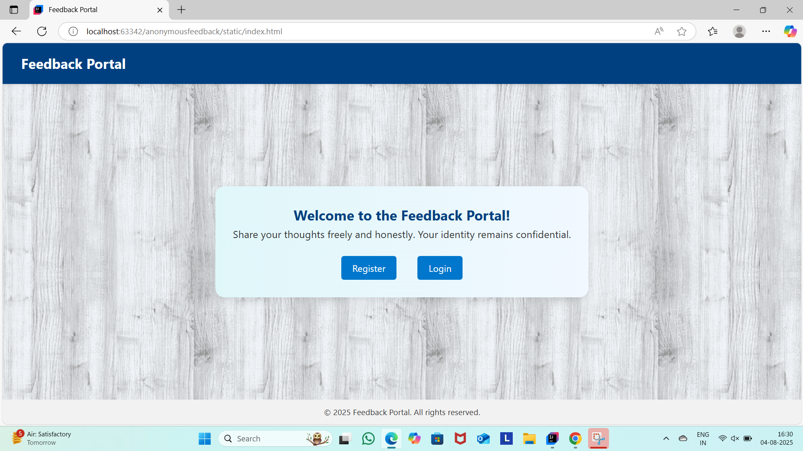
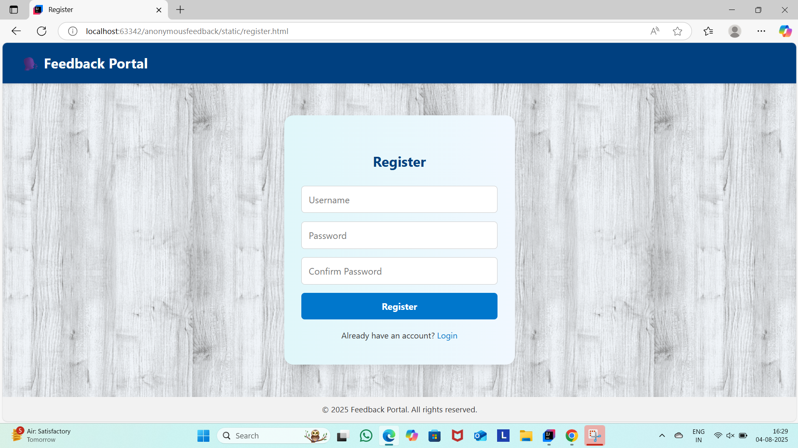
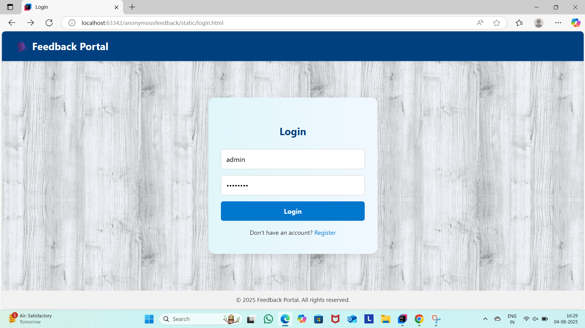
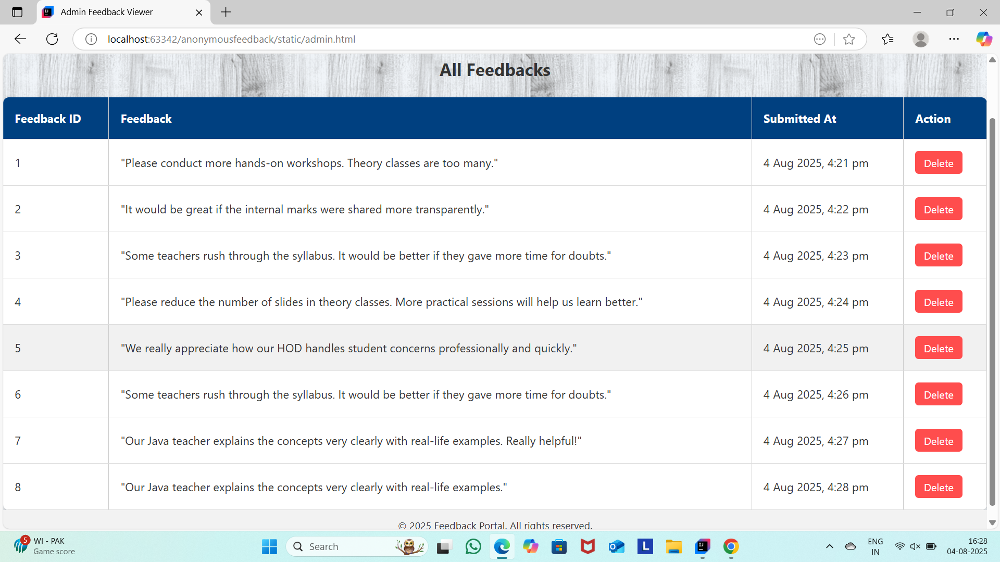

# 📝 Feedback Portal

A full-stack web application where **students can submit anonymous feedback** to the **Head of Department (HOD)** without revealing their identity. The HOD can **view and manage all feedback** through a secure admin panel.

💻 Live Demo: https://feedbackanonymousportal.netlify.app/

---

## 🎯 Use Cases

### 👩‍🎓 For Students:
- ✅ Login and submit genuine feedback without fear of being identified  
- ✅ Share opinions about classes, teaching, labs, or facilities  
- ✅ No personal information (like name or ID) is stored with the feedback  

### 👨‍🏫 For HODs (Admins):
- ✅ Login with secure credentials  
- ✅ View all feedback submitted by students  
- ✅ Delete irrelevant or duplicate feedback  
- ✅ Use feedback to improve academic or administrative processes  

---

## 📌 Features

- 🔒 Login & Registration  
- 🧾 Submit Anonymous Feedback  
- 🧑‍💼 Admin (HOD) Panel to View & Delete Feedback  
- 🌐 Spring Boot REST API  
- 💾 MySQL Database Integration  

---

## 🖼️ Screenshots

### 🔹 Home Page

### 🔹 Register Page

### 🔹 Login Page

### 🔹 Feedback Form (Student)

### 🔹 Admin Dashboard

---

## 🛠️ Tech Stack

- **Frontend**: HTML, CSS, JavaScript  
- **Backend**: Java Spring Boot, Spring Security  
- **Database**: MySQL  
- **Tools**: IntelliJ IDEA, Postman, MySQL Workbench  

---

## 🔐 Default Admin (HOD) Login

- **Username**: `admin`  
- **Password**: `admin123`  

---

## 🤝 Author

**Mounika Malineni**  
📧 mounikamalineni63@gmail.com  
🔗 [GitHub Profile](https://github.com/mounikamalineni26)  
🔗 [LinkedIn Profile](https://www.linkedin.com/in/mounikamalineni)

