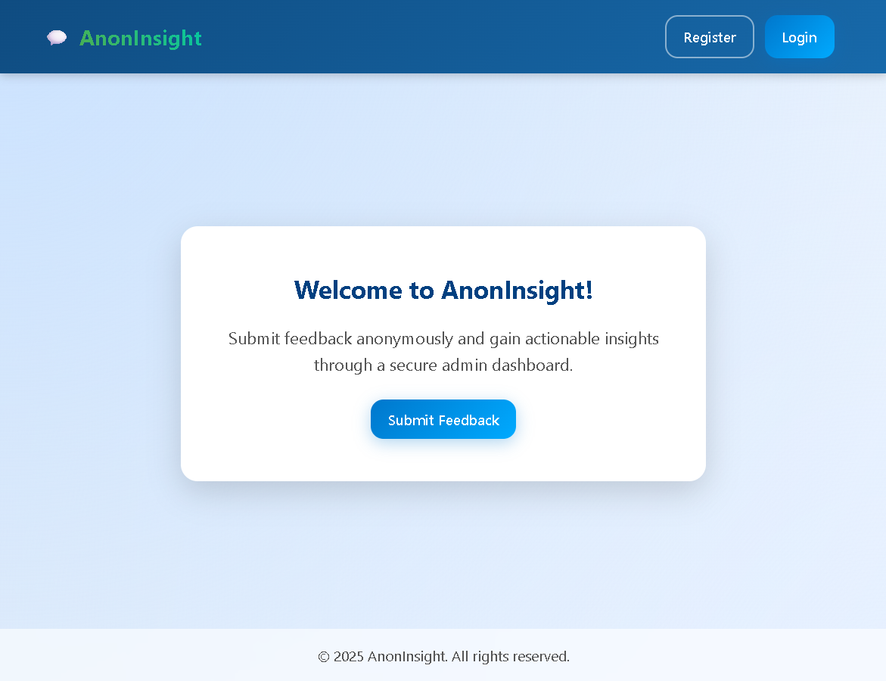
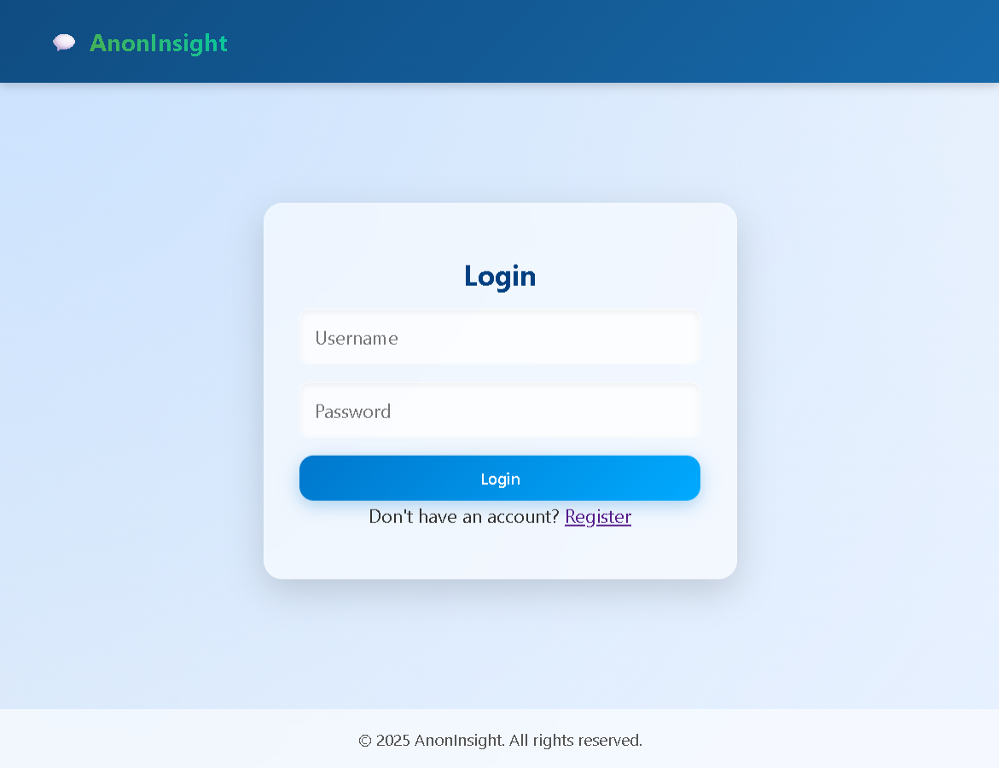
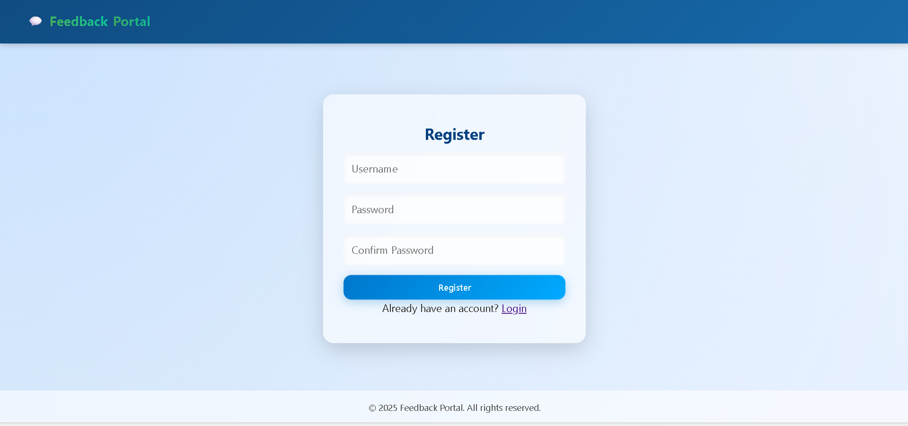
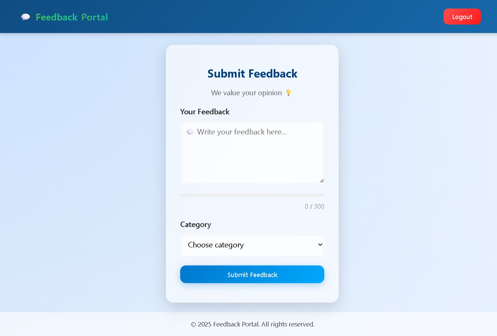
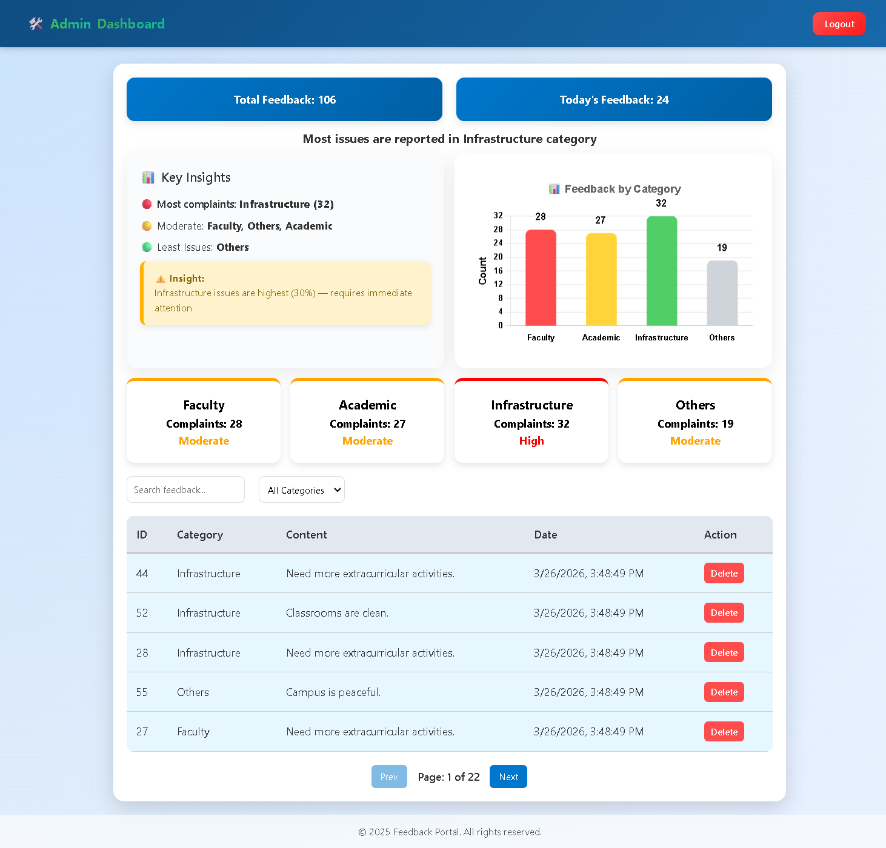

# AnonInsight (Anonymous Feedback & Analytics System) 

  
  
  


---

## 🚀 Project Overview  

**AnonInsight** is a full-stack web application built using **Spring Boot** and **MySQL** that enables students to submit anonymous feedback securely.  

The system follows a **privacy-first design** while allowing administrators (HODs) to **analyze, manage, and take action on feedback through an interactive dashboard**.  

---

## ❗ Problem Statement  

In many institutions, students hesitate to share honest feedback due to fear of being identified.  

This project solves that problem by providing a **secure and anonymous platform** for open communication between students and administration.  

---

## ⭐ Key Highlights  

- 🚀 Developed a complete **end-to-end full-stack application**  
- 🔐 Implemented **anonymous feedback system** (privacy-focused)  
- 🎨 Designed a **responsive UI** using HTML, CSS, JavaScript  
- 🔗 Integrated backend using **RESTful APIs**  
- 📊 Built an **analytics dashboard with insights & visualization**  
- 🧠 Focused on solving a **real-world communication gap**  

---

## 🎯 Use Cases  

### 👩‍🎓 For Students:  

* ✅ Submit honest feedback anonymously without fear  
* ✅ Share opinions on academics, faculty, labs, or facilities  
* ✅ No personal data (name, ID) is stored  

### 👨‍🏫 For HODs (Admins):  

* ✅ Secure login access  
* ✅ View and manage all feedback  
* ✅ Filter and search for better insights  
* ✅ Take action to improve institutional processes  
* ✅ Delete inappropriate or resolved feedback  

---

## 🚀 Core Features  

* 🔒 Secure Login & Registration  
* 🧾 Anonymous Feedback Submission  
* 🧑‍💼 Admin Dashboard  
* 🔍 Search and Filter Feedback  
* 🗑️ Delete Feedback Option  
* 🌐 REST API (Spring Boot)  
* 💾 MySQL Database Integration  

---

## 📊 Analytics Dashboard  

The application includes an **interactive analytics dashboard** that converts raw feedback into **actionable insights for data-driven decisions**.  

### 🔍 Dashboard Features  

* 📈 **Real-time Metrics** – Total feedback & today’s submissions  
* 🏷️ **Category-wise Analysis** – Distribution of feedback across categories  
* 📊 **Data Visualization** – Bar chart for quick understanding  
* 🧠 **Key Insights Section** – Highlights most reported issues  
* ⚠️ **Priority Indicators** – Marks categories as High / Moderate  
* 🔎 **Search & Filtering** – Enables detailed feedback analysis  

### 💡 Impact  

- Helps admins **identify critical issues quickly**  
- Enables **data-driven decision making**  
- Transforms feedback into **actionable insights**  

---

## 🔄 Application Flow  

Student → Submit Feedback → Stored in MySQL Database → Admin Dashboard → View / Filter / Manage Feedback  

---

## 🔐 Security Features  

- 🔑 Password encryption using **BCrypt**  
- 👤 Role-based authentication & authorization  
- 🔐 Secured APIs using **Spring Security**  
- 🚫 Ensures **complete anonymity of users**  

---

## ⚙️ Setup Instructions  

### 1. Clone the repository  
```bash
git clone https://github.com/mounikamalineni26/feedback-portal.git
```

### 2. Open in IDE  
- Import into IntelliJ IDEA  

### 3. Configure MySQL  
- Create database:  
```sql
anonymous_feedback_db
```

- Update application.properties  
```properties
spring.datasource.username=your_username  
spring.datasource.password=your_password  
```

### 4. Run the application  

### 5. Open  
http://localhost:8080  

---

## 🖼️ Screenshots  

### Home Page  
  

### Login Page  
  

### Register Page  
  

### Submit Feedback  
  

### Admin Dashboard  
  

---

## 🛠️ Tech Stack  

* **Frontend**: HTML, CSS, JavaScript  
* **Backend**: Java, Spring Boot, Spring Security  
* **Database**: MySQL  
* **Tools**: IntelliJ IDEA, Postman, MySQL Workbench  
* **Visualization**: Chart.js  

---

## 🔐 Default Admin Login  

* Username: admin  
* Password: admin123  

⚠️ These credentials are for testing only. Use secure authentication in production.  

---

## ✅ Testing  

* ✔ APIs tested using Postman  
* ✔ End-to-end workflow verified  

---

## 🤝 Author  

**Mounika Malineni**  

📧 mounikamalineni63@gmail.com  
🔗 https://github.com/mounikamalineni26  
🔗 https://www.linkedin.com/in/mounikamalineni  
